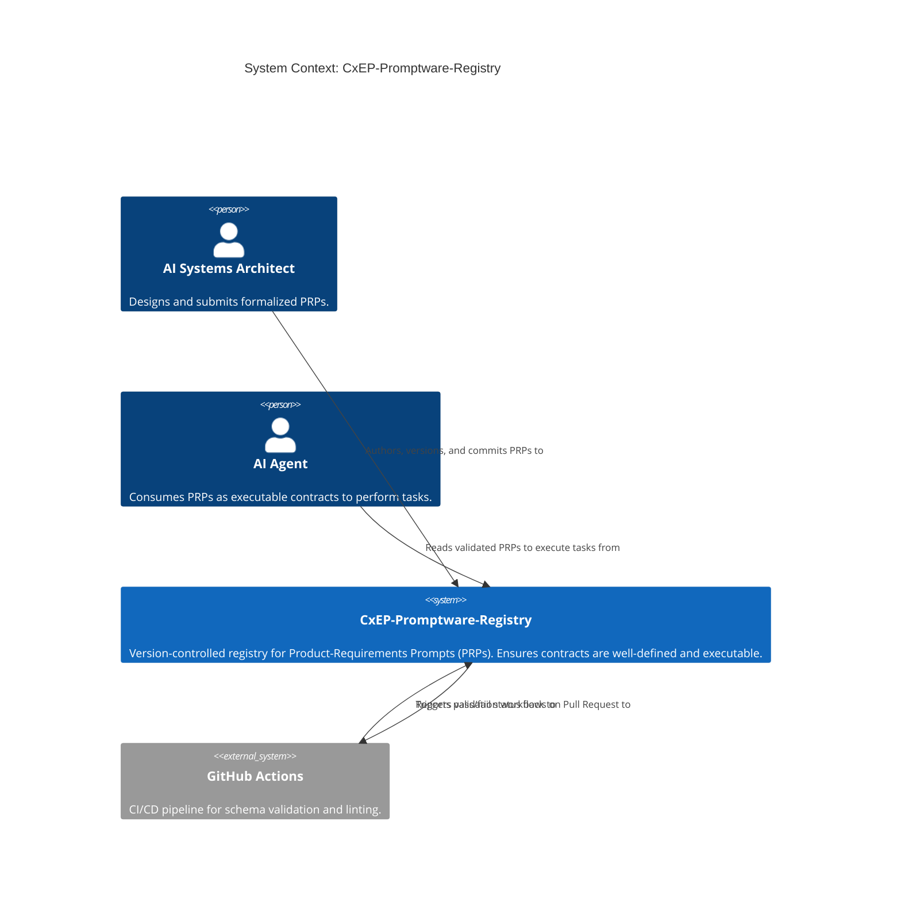
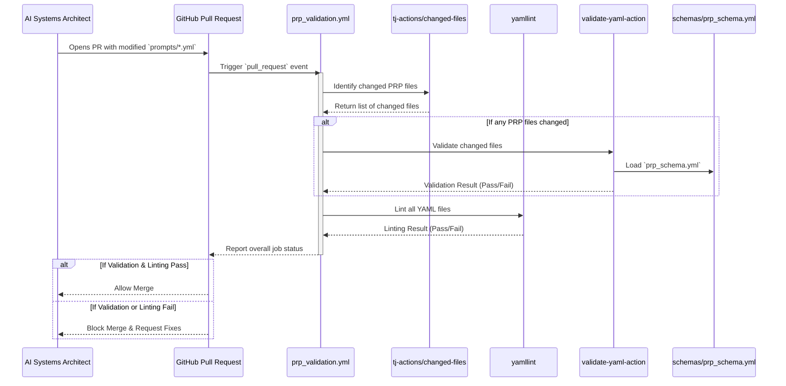
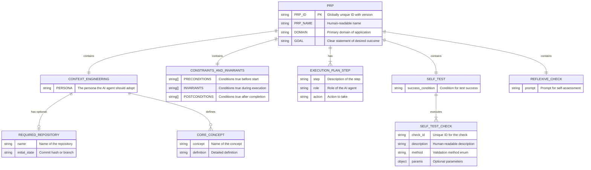

# 🗺️ System Architecture

This document describes the architectural boundaries, workflows, and schema relationships within the **CxEP-Promptware-Registry**. It maps the registry's core structural elements to clarify the invisible dependencies governing Product-Requirements Prompts (PRPs).

## 1. System Context: The PRP Registry Ecosystem

This context diagram defines the high-level boundaries of the registry, illustrating how human architects and AI systems interact with the formalized prompt registry.

## 2. CI/CD Validation Pipeline Sequence

This sequence diagram visualizes the trust boundary between user submissions, the GitHub Actions validation pipeline, and the schema definitions. It explicitly outlines the validation steps that prevent invalid PRPs from merging.

## 3. PRP Object Model (Entity Relationship Diagram)

This entity-relationship diagram maps the internal structure of a Product-Requirements Prompt (PRP) as defined by `prp_schema.yml`. It explicitly visualizes the required nested objects and their cardinality.

